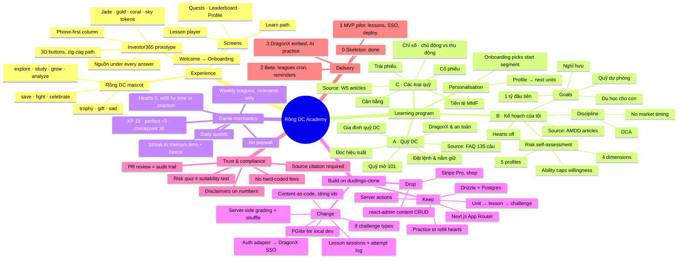

# Mindmap: how Rồng DC Academy is built

Renders on GitHub (Mermaid). See [ARCHITECTURE.md](./ARCHITECTURE.md) for detail.

```mermaid
mindmap
  root((Rồng DC Academy))
    Experience
      Investor365 prototype
        Phone-first column
        Jade · gold · coral · sky tokens
        3D buttons, zig-zag path
        Nguồn under every answer
      Rồng DC mascot
        explore · study · grow · analyze
        save · fight · celebrate
        trophy · gift · sad
      Screens
        Welcome → Onboarding
        Learn path
        Lesson player
        Quests · Leaderboard · Profile
    Learning program
      A · Quỹ DC
        Quỹ mở 101
        Gia đình quỹ DC
        Đặt lệnh & nắm giữ
        Đọc hiệu suất
        DragonX & an toàn
        Source: FAQ 135 câu
      B · Kế hoạch của tôi
        Risk self-assessment
          4 dimensions
          5 profiles
          Ability caps willingness
        Goals
          1 tỷ đầu tiên
          Du học cho con
          Nghỉ hưu
          Quỹ dự phòng
        Discipline
          DCA
          No market timing
        Hearts off
        Source: AMDD articles
      C · Các loại quỹ
        Tiền tệ MMF
        Trái phiếu
        Cổ phiếu
        Chỉ số · chủ động vs thụ động
        Cân bằng
        Source: W5 articles
      Personalisation
        Onboarding picks start segment
        Profile → next units
    Game mechanics
      XP 15 · perfect +5 · checkpoint 30
      Hearts 5, refill by time or practice
      Streak in Vietnam time + freeze
      Weekly leagues, nickname only
      Daily quests
      No paywall
    Build on duolingo-clone
      Keep
        Next.js App Router
        Server actions
        Drizzle + Postgres
        Unit → lesson → challenge
        Practice to refill hearts
      Change
        Content-as-code, string ids
        9 challenge types
        Server-side grading + shuffle
        Lesson sessions + attempt log
        Auth adapter → DragonX SSO
        PGlite for local dev
      Drop
        Stripe Pro, shop
        react-admin content CRUD
    Trust & compliance
      Source citation required
      Disclaimers on numbers
      No hard-coded fees
      PR review = audit trail
      Risk quiz ≠ suitability test
    Delivery
      0 Skeleton: done
      1 MVP pilot: lessons, SSO, deploy
      2 Beta: leagues cron, reminders
      3 DragonX embed, AI practice
```
